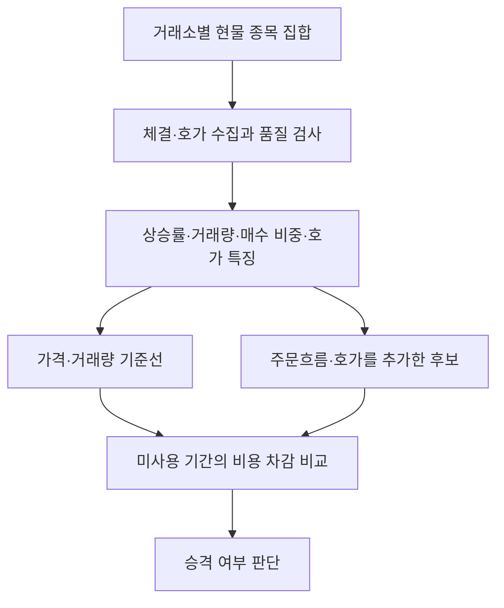

# FAST Tracker 개발·검증 계획

작성일: 2026-09-18. 사용자가 정의한 FAST는 **각 거래소 내부 급등을 포착하여 짧은 진입·청산을 반복하는 고빈도 매매전략**이다. WHALE은 글로벌 WAVE 분석의 기초자료 중 하나다. FAST를 WAVE 공통 5종목, 단순 가격 가속, 또는 온체인 전송 점수와 동일시하지 않는다.

현재 판단: **개발 초기 / 수익성 미검증 / 실주문 OFF / 운영 Shadow 중단 유지**. VPD의 개발 진척과 VPD의 투자성과 검증 여부도 서로 다른 항목이다.

## 현재 우선 설계 — FAST v2 (사용자 구체화 반영)

전 종목 체결·호가를 상시 저장하는 구조를 채택하지 않는다. **가벼운 현재가 스냅샷 → 10·15·30분 상승률/순위 변화 → 상위 소수 후보만 5~10분 관찰 → 짧은 모의 진입·청산 반복**이 목표다.

- 기본 연구 설정: 15분 스캔, 상위 5종목, 관찰 5분. 스캔 10/15/30분과 관찰 5~10분 선택 가능.
- 전체 적격 종목의 가격만 분 단위로 비교한다. 거래소 화면의 전일/24시간 상승률을 단기 수익률로 대신 쓰지 않는다. 시작 직후 기준 가격이 없으면 워밍업, 누락된 기준값은 계산하지 않는다.
- 상승률 Top 또는 동일 시간축 순위 급상승을 후보로 고른다. 초기 상승률 1%, 순위 5칸은 검증용 가정이며 사용자 확정 수치가 아니다.
- 후보만 짧게 호가를 본다. 30초 고점 재돌파 → 지연 후 ask 모의 진입 → 순익 목표/손절/돌파 실패/최대 보유/관찰 종료 → 지연 후 bid 모의 청산.
- 청산 후 쿨다운·새 기준 구간이 생겨야 재진입. 5~6회 또는 10~15회는 반드시 채울 목표가 아니다. 세션 전체 진입 상한 15회, 누적 모의 손실 제한을 적용한다.
- 편도 비용 가정 15bps(수수료10+추가슬리피지5)라면 왕복 약30bps에 스프레드가 더해진다. 몇 틱 상승만으로 순이익이라고 보지 않는다. 초기 순익 목표15bps·손절45bps는 가정이며 실측 비용으로 다시 맞춰야 한다.
- 공통 budget의 net_bps 합은 동일 실험금액의 연구용 제한이며 계좌 수익률이 아니다. 자본배분·동시 노출·실주문 부분체결은 미구현.
- `magi2/fast_lab/rank_tracker.py`: 순위 계산과 후보별 반복 PAPER 상태기계 구현. 실제 REST 스냅샷 수집기/후보 WS 구독·해제/Telegram 랭킹 화면 연결은 아직 미구현. MAGI3 Shadow·실주문에 연결하지 않음.
- 누락 호가·부족 잔량·관찰 종료 미청산은 미확인으로 제외한다. 기준값·거래 횟수를 조절해 성과를 만들지 않는다.

기존 전 종목 실험 결과는 `fast_connectivity_20260918.json`에 집계만 보존한다. Upbit 체결8929건/실제 활동240종목, Binance 체결80318건/활동455종목. v1 후보0건으로 수익성 성과는 산출할 수 없다. 사용자가 FAST 전용 대용량 원본 삭제를 승인했다. 아래 v1 내용은 비교용 연구 기록이며 v2 운영 설계가 아니다.

공식 규격: [Upbit 현재가](https://docs.upbit.com/kr/reference/list-tickers), [Binance 시장 데이터](https://developers.binance.com/en/docs/catalog/core-trading-spot-trading/api/rest-api/market).

## 이번에 만든 것과 아직 남은 것

| 영역 | 이번 결과 | 남은 단계 |
|---|---|---|
| 거래소별 종목 집합 | Upbit KRW·Binance USDT 독립 종목 조회, 제외 사유·시점·목록 해시 기록 | Bithumb/Kraken 확장, 운영 중 신규 상장·중단 상태 갱신 |
| 공개 데이터 수집 | 명시적으로 실행하는 기간 제한 WS 수집 CLI, 연결 단절 기록, 별도 압축 tape | 운영 부하 측정·장기 수집·신뢰할 수 있는 L2 복원 |
| 특징 | 10/30/60초 실제 상승률, 과거 변동성, 거래대금 증가, 매수 체결 비중, 스프레드, L1 잔량 불균형·OFI | 수급 지속성, 호가 취소/재보충, 최소 거래대금·신규 상장 분석 |
| 진입 기준 | 버전·해시 고정 연구 기본값; 가격·거래량·매수비중·스프레드 필터 | 날짜 순 학습/검증을 통한 기준 선택과 최종 미사용 기간 확인 |
| 재생 검증 | 미래에 실제 수신한 호가에서 모의 진입/청산; 편도 비용·지연; 10/30/60/300초 성과 | 비신호 비교군, 날짜/이벤트 군집 신뢰구간, 체결·큐 모델 |
| 반복 매매 | 오프라인 진입 대기→보유→익절/손절/시간청산→쿨다운 상태기계 | 실시간 FAST 실행 루프, 거래소 주문 제약·미체결 대사·재시작 복구 |
| 운영 화면 | 기존 `/fast`는 여전히 WAVE 공통 5종목 기준임을 표시 | 새 수집·평가 결과를 연결한 전용 `/fastreport` |

새 연구 코드는 기존 수집기·PAPER·Shadow를 자동 실행하지 않는다. 기존 MAGI1 원시 스키마, FeatureEngine, formation/propagation, 보존 정책은 수정하지 않았다. 새 도구에는 계좌 키나 주문 API가 없다.

## 국내외 자료에서 채택한 연구 가설

아래 연구 결과는 FAST의 코인 매매 수익성을 증명하지 않는다. 주식시장 결과는 코인 데이터로 다시 검증하며, 조작 탐지 분류 성능은 거래 손익과 분리한다. 논문 수치를 목표 수익률이나 성공확률로 사용하지 않는다.

1. **Cont·Kukanov·Stoikov — The Price Impact of Order Book Events** (2014, Journal of Financial Econometrics; 공개 원고 2011). 미국 주식에서 단기 가격 변화와 주문흐름 불균형 및 시장 깊이의 관계를 연구했다. FAST에는 거래량만 보는 기준과 OFI를 더한 기준을 별도로 비교하는 가설을 가져온다. 현재 L1 표본 OFI는 전체 이벤트가 빠짐없이 보존된 원 논문의 자료와 동등하지 않다. [원문](https://arxiv.org/abs/1011.6402)
2. **Gould·Bonart — Queue Imbalance as a One-Tick-Ahead Price Predictor** (2015 공개 원고). Nasdaq 10종목의 호가 잔량 불균형과 다음 가격 변화의 관계를 분석했다. FAST에는 큐 불균형을 보조 특징으로 기록하되, 다음 틱 방향을 맞추는 것과 수수료 차감 수익을 구분한다. [원문](https://arxiv.org/abs/1512.03492)
3. **Yu·Park·Chai — Improving Cryptocurrency Pump-and-Dump Detection…** (2025 공개 원고; 이화여대·금오공대 연구진). 희소한 조작 사례의 불균형 분류와 학습자료에만 적용하는 SMOTE를 다룬다. FAST에는 정확도 하나 대신 정밀도·재현율·오탐률을 함께 보고, 합성 표본을 테스트 기간에 넣지 않는 원칙을 적용한다. 이 연구의 탐지 성능은 매매 수익 실적이 아니다. [국내 연구진 원문](https://arxiv.org/pdf/2510.00836)
4. **La Morgia 외 — The Doge of Wall Street** (2021 공개 원고). 암호자산 펌프앤덤프 사례와 탐지를 연구한다. FAST는 이미 오른 종목에 늦게 진입하는 위험을 별도 측정하고, 급등 탐지 시각과 실제 진입 가능 시각을 구분한다. [원문](https://arxiv.org/abs/2105.00733)
5. **거래소 공식 규격**: [Upbit 종목 목록](https://docs.upbit.com/kr/reference/list-trading-pairs), [체결 WebSocket](https://docs.upbit.com/kr/reference/websocket-trade), [호가 WebSocket](https://docs.upbit.com/kr/reference/websocket-orderbook), [요청 제한](https://docs.upbit.com/kr/reference/rate-limits), [Binance Spot streams](https://developers.binance.com/en/docs/catalog/core-trading-spot-trading/api/ws-streams/~). 데이터 수신 형식·호가 제공 범위·실행 경로를 설계하는 자료이며 전략 성과 근거는 아니다.

국내 기관 보고서 검색도 시도했으나 관련 원문을 확보하지 못한 자료는 근거 목록에 넣지 않았다. 위 국내 연구진 논문과 거래소 한국어 공식 문서를 직접 확인했다.

## 연구할 탐지 구조



- 시간축은 로컬 수신 시각이 기준이다. 거래소 시각도 보존하되, 나중에 받은 정보를 과거에 이용 가능했던 것처럼 재배열하지 않는다.
- 10초 상승폭을 해당 종목의 이전 변동성과 비교한다. 모든 코인에 같은 변화폭이 같은 의미라고 가정하지 않는다.
- 거래량은 실제 체결의 가격×수량을 합산한다. 24시간 rolling 거래량의 차이를 10초 거래량으로 오인하지 않는다.
- 매수 체결 비중과 주문흐름·호가 깊이의 효과는 제거/추가 비교로 검증한다. 지금 OFI와 큐 불균형은 기록만 하며, 검증 없이 필수 조건으로 승격하지 않았다.
- 스프레드 확대, 유동성 부족, 오래된 호가, 데이터 단절은 명시적 제외 사유로 남긴다. 미확인 결과를 손익 0으로 넣지 않는다.
- 감시 대상에는 한 거래소에만 있는 종목도 포함된다. WAVE 공통 교집합은 사용하지 않는다.

## 초기 연구 기본값 — 투자 권고나 확정 전략 아님

`Policy`는 해시로 고정한다. 기본값은 코드를 검증하고 데이터 수집을 시작하기 위한 값이며 최적화를 거치지 않았다.

| 항목 | 초기 값 | 해석 |
|---|---:|---|
| 10초 상승률 | 20bps 이상 | 실제 양수 상승 필요; 하락 둔화 제외 |
| 과거 변동성 대비 | 3배 이상 | 이전 60초의 1초 수익률 표준편차를 10초로 환산한 연구 가정 |
| 거래대금 배수 | 2배 이상 | 이전 60초 평균을 10초 기준으로 환산하여 비교 |
| 매수 체결대금 비중 | 60% 이상 | 거래소 aggressor side 기준 |
| 스프레드 | 30bps 이하 | 현재 관측 가능한 비용 필터 |
| 기본 추가 지연 | 진입·청산 각각 250ms | 실측 지연이 아님; 100/500/1000ms 민감도 비교 필요 |
| 편도 수수료 / 추가 슬리피지 | 10bps / 5bps | 계좌별 실제 수수료가 아닌 가정 |
| 순손익 익절 / 손절 | +40bps / −30bps | 비용 차감 예상 청산가로 조건 감지, 지연 후 호가에서 결과 산출 |
| 최대 보유 / 재진입 제한 | 60초 / 종목·거래소당 300초 | 초기 중첩 표본 억제용. 생산용 고빈도 정책 확정값 아님 |
| 실험 주문 크기 | KRW 10,000 / USDT 10 | 서로 다른 통화 손익을 합산하지 않음 |

지연은 조건 발생 시각 이후부터 추가한다. 익절 조건을 본 호가에 즉시 체결된 것으로 처리하지 않는다. 매수 ask·매도 bid를 사용하므로 스프레드는 이미 반영되며 비용에 다시 이중 가산하지 않는다. 노출된 호가 잔량이 부족하면 전량 체결로 가정하지 않는다.

## VPD 수준으로 올리는 단계와 완료 조건

| 단계 | 산출물 | 다음 단계 조건 |
|---|---|---|
| A. 재현 가능한 관측 | 독립 universe, 수신 시각, 연결 단절, 원본 tape·정책 해시 | 거래소별 수신·중복·누락·재접속·메모리·디스크 측정 완료 |
| B. 탐지 평가 | 기준선 대비 신호의 선행 시간, 지속 상승·급반락, 오탐/누락, 10/30/60/300초 평가 | 신호/비신호 비교군과 이벤트 군집이 확보됨 |
| C. 반복 매매 재생 | 진입·익절·손절·시간청산, 비용·지연 민감도, 거래회전율·낙폭 | 날짜 순 학습/검증/최종 미사용 기간에서 재현되고 비용 증가에도 효과 유지 |
| D. 실시간 Shadow | 동일 정책·동일 주문 제약, 주문/체결/취소 상태, 장애 복구 | 사용자 재개 지시 후 시작. 재생 대비 체결 차이와 운영 오차 확인 |
| E. 제한된 실거래 | 소액 한도, 거래소별 제약, 중단·대사·복구 | 별도 사용자 승인과 미체결·취소 경합·재연결 검증 통과 |

분석 시작 목표는 14일·200개 독립 이벤트지만 충분성 보장은 아니다. 기준선, OFI 추가, VPD 결합 등 비교 수가 늘면 최종 미사용 기간을 따로 남긴다. 같은 300초 움직임의 수십 개 신호를 독립 성공으로 세지 않는다. 날짜·종목 편중, 제외율과 사건별 비중을 보고한다. 고정된 최종 기간에서 비교군 대비 비용 차감 효과와 군집 단위 신뢰구간이 확인되기 전에는 `NOT_VALIDATED`다.

평가 보고에는 검출 수, 유효/제외 표본과 사유, 거래소·통화별 평균/중앙 순수익, 양수 비율, 지연별 악화, 최대 유리/불리 변화, 정책별 종료 사유를 포함한다. 현재 도구는 이 중 기본 통계와 종료 사유까지 제공하며, 비교군·군집 신뢰구간·walk-forward 학습·자본 제약 포트폴리오는 미구현이다.

## 고빈도 실행으로 넘어갈 때 필요한 구현

1. Telegram 조회 경로와 매매 판단 루프를 분리한다. Telegram은 상태·중단·재개 콘솔이며 매 틱 처리 경로가 아니다.
2. 거래소별 로컬 호가장은 snapshot+sequence/delta 검증, 순서 역전·누락 시 재동기화를 구현한다. 지금 L1 capture는 이를 대체하지 않는다.
3. 주문 상태는 `INTENT → SENT → ACK → PARTIAL/FILLED/CANCEL_PENDING → CLOSED`로 기록한다. 타임아웃을 거절로 단정해 재주문하지 않고 client id로 조회·대사한다.
4. IOC/시장성 지정가를 먼저 비교한다. 수동 지정가의 큐 순서와 체결 확률이 없는 상태에서 maker 체결을 낙관적으로 계산하지 않는다.
5. 최소 주문금액·호가 단위·수량 단위·주문 수 제한·수수료를 거래소/계좌별 최신 규격으로 적용한다. 가격 상승 신호가 크더라도 체결 불가능하면 진입하지 않는다.
6. 수신→판단→전송→승인→체결의 p50/p95/p99 지연을 기록한다. 공개 인터넷·현재 호스팅 구조에서 초미세 지연 HFT 성능을 보장하지 않는다. 초기에는 수초~수분 보유의 반복 전략을 검증하고, 실측 한계에 맞춰 거래소 인접 배치와 경량화를 결정한다.
7. 재개는 별도 명시적 조작이어야 한다. `/fast`, `/shadow`, 보고서 조회로 매매가 시작되면 안 된다.

## 실행 방법

생성 자료는 거래소 관측 tape이며 전략 수익 실적이 아니다. 아래 명령은 운영 Shadow 설정을 읽거나 변경하지 않는다.

```bash
# 공개 데이터만 수집. 기존 파일을 덮어쓰지 않음. 기본값은 전체 적격 종목.
python -m magi1.fast_capture --venues upbit binance --duration 600 --output /tmp/fast-session.jsonl.gz

# 연결 검증용 제한 표본은 반드시 EXPLICIT_TEST_CAP으로 기록된다.
python -m magi1.fast_capture --venues upbit --max-symbols 5 --duration 120 --output /tmp/fast-probe.jsonl.gz

# 결정론적 오프라인 재생. 계좌·실주문·운영 Shadow와 독립.
python -m magi2.fast_lab.replay --input /tmp/fast-session.jsonl.gz --output /tmp/fast-report.json
```

Upbit는 trade 메시지에 제공된 최우선호가를 기록하므로 **체결 시점의 L1 표본**이다. Binance는 종목별 trade와 bookTicker를 기록한다. 관측 해상도 차이를 보고서에서 숨기지 않는다. 드문 종목은 유효 호가가 부족해 제외될 수 있다. 연결 단절은 진행 중 결과에 표시하고 과거 결과를 임의로 복원하지 않는다.

지금 작업 환경의 실제 REST 연결 시도는 두 거래소 모두 시간 초과였다. 따라서 이번 검증 근거는 자동화된 합성/경계 테스트이며 실시간 전종목 수집 성공이나 실제 손익이 아니다. 다음 운영 검증은 거래소에 연결 가능한 환경에서 위의 기간 제한 수집으로 시작한다. 연구 도구는 저장소에 추가했지만 운영 봇의 기존 5종목 탐지 경로를 자동 교체하지 않았다.


## 거래소 개인 API 연결 순서

공개 시세 수집과 계좌 인증을 분리한다. FAST/WAVE 연구를 위해 거래소 개인 키를 발급할 필요는 없다. Upbit는 이미 자산 조회 인증에 성공했으며 일부 자산 평가 누락은 별도 보완 대상이다.

| 거래소 | 공개 시세 연구 | 계좌 조회 키 | 주문 권한 |
|---|---|---|---|
| Upbit | FAST 우선 검증, KRW 현물 | 연결 완료, 평가 누락 보완 | 검증·명시적 재개 전까지 비활성 |
| Bithumb | 국내 현물 확장 2순위 | 실제 잔고 통합이 필요하면 지금 연결 | Upbit 검증 후 별도 체결 검증 |
| Binance | FAST 비교군·WAVE 입력 우선 | 보유 계좌 잔고 통합이 필요하면 지금 연결 | 국내 현물 우선 방침에 따라 보류 |
| Kraken | WAVE 관측 지속, FAST 확장은 후순위 | 실제 계좌 보유·통합 필요 시 | 후순위 |

처음에는 자산/잔고와 필요한 주문 내역 조회만 허용한다. 모든 키는 MAGI3에만 저장하며 MAGI1에 넣지 않는다. 거래소별 IP 등록 정책에 따라 MAGI3 고정 출구 IP를 등록한다. 계좌 연결 완료가 주문 허용이나 전략 수익성 검증 완료를 의미하지 않는다. 주문 연결 전에는 최소 주문/수량 단위, 수수료, 부분체결, 취소 경합, 재시도 중복, 재시작 복구를 거래소별로 검증해야 한다.

공식 API 문서: [Bithumb](https://apidocs.bithumb.com/), [Binance 공개 시세 스트림](https://developers.binance.com/docs/binance-spot-api-docs/web-socket-streams), [Kraken](https://docs.kraken.com/).

## Telegram 조회 구분

`VPD 모의투자`(/report)는 MAGI2 가상자금 포트폴리오, `실계좌 자산`(/assets)는 MAGI3 거래소 실제 잔고다. `시스템 상태`(/status)에서 MAGI1 관측 인터페이스, MAGI2 PAPER 작업, MAGI3 실행 상태를 선택한다. MAGI1의 최신 인터페이스 응답만으로 개별 거래소 수집기의 전체 품질을 정상이라고 단정하지 않는다. 기존 명령은 호환 유지한다.

### 일회성 실데이터 검증 작업

`python -m magi2.fast_lab.live_job --output-dir /data/fast --run-id fast-public-001 --duration 600`

- 기존 MAGI1 WAVE 프로세스와 분리된 연구 작업. 공개 API만 사용하며 주문/텔레그램/계좌 키 불필요.
- 거래소별 전체 적격 현물 유니버스, 600초 제한, 거래소별 비압축 150MB 제한. 종료 후 자동 재시작 금지.
- Railway에서는 영구 볼륨 필수. 동일 run-id 디렉터리가 있으면 재수집하지 않음. 재시도는 새로운 run-id로 명시적으로 실행.
- `.jsonl.gz`, 품질 JSON, 비용 포함 replay JSON, 최종 result.json을 볼륨에 보존. 로그에는 집계만 출력.
- 거래소 한 곳의 discovery 실패를 다른 거래소와 분리. 연결 오류·빈 데이터도 결과에 기록.
- 수신시각-거래소시각은 시계 오차를 포함하므로 순수 네트워크 지연이 아님. Binance bookTicker의 누락 시각은 별도 집계.
- 무거래 종목은 미수집 확정 판정이 아님. 관측 gap 수는 모든 패킷 누락을 증명하지 못함.
- 10분 작업은 연결·데이터·분석 파이프라인 검증용. 후보가 없거나 300초 후행 관측이 부족하면 그대로 제외 처리. 수익성 판정은 NOT_VALIDATED.
